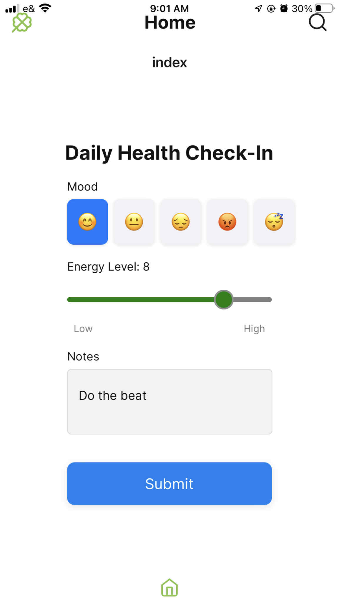
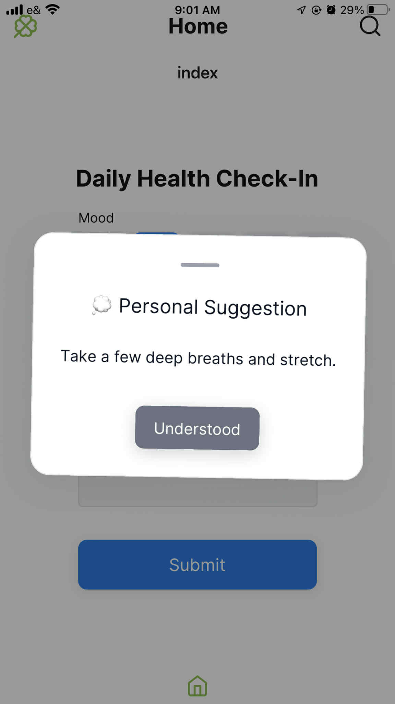
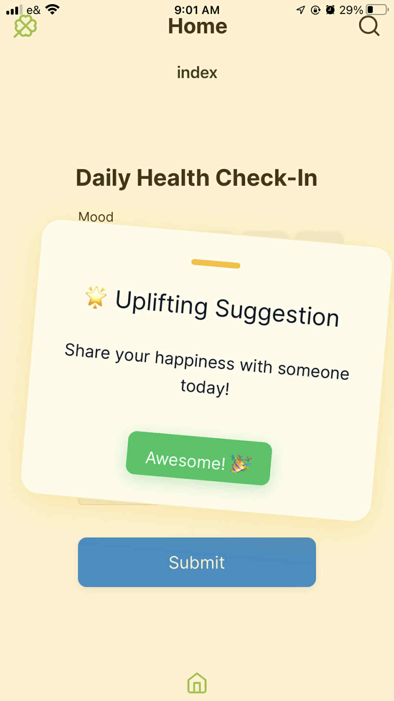
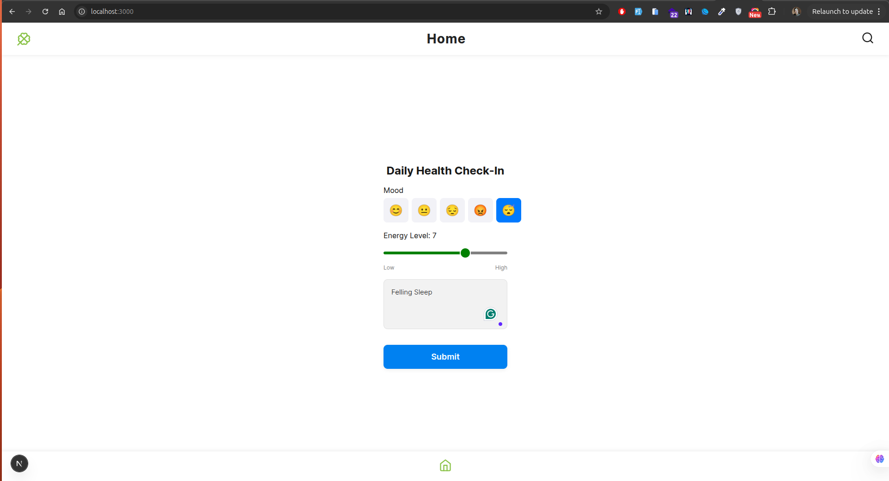
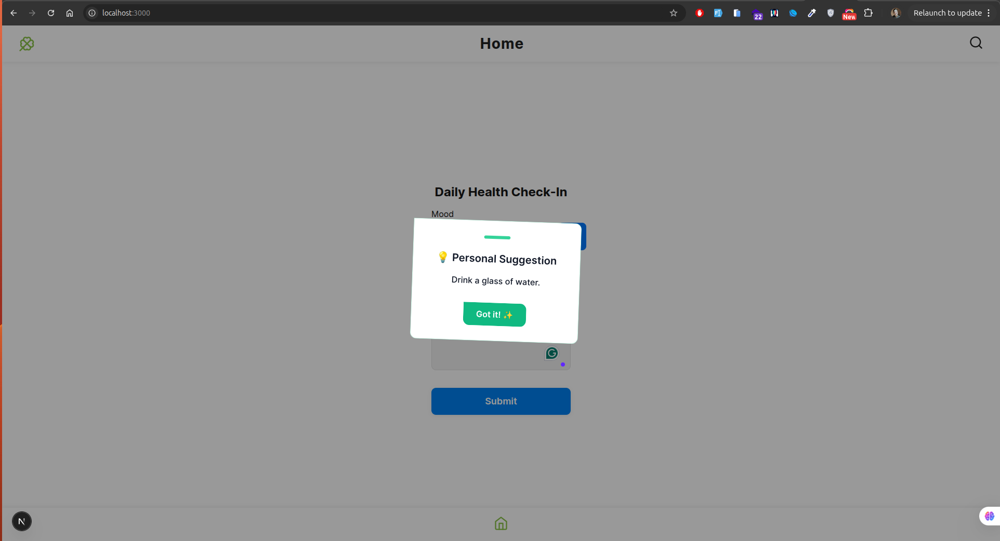

# 🏥 Health Coach System

A modern, comprehensive health coaching platform built with cutting-edge technologies. Track your Mood across web, mobile, and backend components with seamless cross-platform synchronization.


## 📸 App Screenshots

### Mobile Screens





### Web Screens





## Project Structure
```
health-coach-system/
├── back-end/           # Backend API server
│   ├── src/
│   │   ├── controllers/
│   │   ├── requests/
│   │   ├── services/
│   │   └── types/
│   └── package.json
├── frontend/           # Frontend monorepo (web, mobile, shared UI)
│   ├── apps/
│   │   ├── expo/       # Expo React Native app
│   │   └── next/       # Next.js web app
│   ├── packages/
│   │   ├── app/        # App-level providers and setup
│   │   ├── config/     # Tamagui config
│   │   └── ui/         # Shared UI components (Tamagui)
│   └── package.json
└── README.md
```

## ✨ Features

### 📱 **Cross-Platform Applications**
- **Web Application**: Next.js 15 with App Router for modern web experience
- **Mobile Application**: Expo React Native app for iOS and Android

### 🏥 **Health Tracking System**
- **Daily Check-ins**: Track mood, energy levels, and personal notes
- **Mood Selector**: Intuitive emoji-based mood tracking
- **Energy Monitoring**: Slider-based energy level tracking (1-10)
- **Personal Notes**: Rich text input for daily reflections

### 🛠 **Technical Features**
- **Shared UI Components**: Tamagui-based design system
- **API Integration**: RESTful backend with Express.js
- **Real-time Updates**: Fast, responsive user experience
- **Type Safety**: Full TypeScript implementation
- **Hot Reloading**: Fast development iteration

## 🛠 Technology Stack

### Frontend (Monorepo)
| Technology | Version | Purpose |
|------------|---------|----------|
| **React** | 19.1 | UI framework with latest concurrent features |
| **React Native** | 0.79.2 | Mobile app development |
| **Next.js** | 15 | Web framework with App Router |
| **TypeScript** | 5.8 | Type safety and better developer experience |
| **Tamagui** | 1.129.3 | Universal design system and UI components |
| **Expo** | SDK 53 | Mobile development platform |
| **Yarn** | 4.5 | Package manager with workspaces |

### Backend
| Technology | Version | Purpose |
|------------|---------|----------|
| **Node.js** | 22 | Runtime environment |
| **Express.js** | Latest | Web framework |
| **TypeScript** | 5.8 | Type safety |
| **npm** | 10.8+ | Package management |


### Component Architecture
- **Shared Components**: Located in `frontend/packages/ui/src/shared/`
- **Platform-Specific**: Web (`/web/`) and Mobile (`/mobile/`) specific components
- **Cross-Platform Forms**: Unified form logic with platform-optimized rendering
- **Universal Theming**: Tamagui provides consistent styling across platforms

## 🚀 Quick Start

### 📋 Prerequisites

- **Node.js** 22+ (LTS recommended)
- **npm** 10.8+ or **Yarn** 4.5+
- **Git**
- **Expo CLI** (for mobile development)
- **iOS Simulator** (macOS) or **Android Studio** (for mobile testing)

### Installation

1. Clone the repository:
```bash
git clone <repository-url>
cd health-coach-system
```

2. Install backend dependencies:
```bash
cd back-end
npm install
```

3. Install frontend dependencies (from the monorepo root):
```bash
cd ../frontend
yarn install
```

### Configuration: API URLs for Web and Mobile

#### Web App API URL
- The web app uses an environment variable to determine the backend API URL.
- **Setup:**
  1. Copy `.env.example` to `.env` in `frontend/apps/next/`:
     ```sh
     cp .env.example .env
     ```
  2. Edit `.env` and set:
     ```env
     NEXT_PUBLIC_API_URL=http://localhost:5000/api/v1
     ```
  3. The web app will use this variable for all backend API requests.

#### Mobile App API URL
- The mobile app uses an environment variable (via Expo config) to determine the backend API URL.
- **Setup:**
  1. In `frontend/apps/expo/app.json` or `app.config.js`, set:
     ```json
     {
       "expo": {
         ...
         "extra": {
           "API_URL": "http://${localeIPAddress}:5000/api/v1"
         }
       }
     }
     ```
  2. The mobile app will use this variable for all backend API requests.

> **Tip:** For both apps, make sure the API URL matches the backend server's address and port.

### Running the Applications

#### Backend
```bash
cd back-end
npm start
```

#### Web App
```bash
cd frontend/apps/next
npm run dev
```

#### Mobile App
```bash
cd frontend/apps/expo
npx expo start
```

## 💻 Development Workflow

### 🏗 Monorepo Structure
This project uses a **monorepo structure** with shared components between web and mobile applications:

- **Shared UI Components**: `frontend/packages/ui/` contains reusable components
- **Shared App Logic**: `frontend/packages/app/` contains business logic and providers
- **Platform-Specific Apps**: Separate apps for web (`next/`) and mobile (`expo/`)
- **Backend API**: Independent Node.js/Express server

### 🔄 Development Scripts

#### Frontend Development
```bash
# From frontend/ directory
yarn web                    # Start Next.js web app
yarn native                 # Start Expo mobile app
yarn ios                    # Run on iOS simulator
yarn android                # Run on Android emulator
yarn build                  # Build all packages
yarn test                   # Run tests
yarn check-tamagui          # Verify Tamagui configuration
```

#### Backend Development
```bash
# From back-end/ directory
npm start                   # Start development server
npm run build              # Build TypeScript
npm test                   # Run tests
npm run lint               # Run ESLint
```

### Shared Check-In Form 
- The `CheckInForm` component in `frontend/packages/ui/src/shared/CheckInForm.tsx` is used by both web and mobile apps.


## 🗓 Project Roadmap

### Foundation ✅
- [x] Cross-platform monorepo setup
- [x] Basic health check-in form
- [x] Shared UI components with Tamagui
- [x] Backend API with Express
- [x] Web and mobile applications


## 🔧 Troubleshooting

### Common Issues

#### React Version Conflicts
```bash
# Clear all node_modules and reinstall
rm -rf node_modules apps/*/node_modules packages/*/node_modules
yarn cache clean
yarn install
```

#### Metro Bundle Issues
```bash
# Clear Metro cache
cd frontend/apps/expo
npx expo start --clear
```

#### API Connection Issues
- Verify backend server is running on correct port
- Check environment variables for API URLs
- Ensure firewall/network settings allow connections

### Development Tips

1. **Hot Reloading**: Both web and mobile support fast refresh
2. **Debugging**: Use React DevTools for web, Flipper for mobile
4. **API Testing**: Use tools like Postman or curl for backend testing


## Implementation Approach & Design Decisions

- **Monorepo Structure:** UI components are shared between web and mobile apps for consistency and maintainability.
- **Environment Variables:** Used for API URLs, making it easy to switch between development and production backends for both web and mobile.
- **UI with Tamagui:** Provides a modern, unified look and cross-platform support.
- **Shared Logic:** The check-in form logic , reducing bugs and maintenance overhead.
- **Provider Setup:** The app is wrapped in a shared Provider that handles theming  rendering for both platforms.

- **One thing to improve if given more time:**
  - **Dockerization:** Add Docker and Docker Compose support to allow running the entire stack (backend, web, and mobile) with a single command: `docker compose up`.
